# StructAlign-evaluator
This study benchmarks nine protein structure alignment algorithms on three downstream tasks. Running time and memory consumption are tested as well. 
* We find large discrepancies between the alignment performance (e.g., TM-score, RMSD) and task accuracy performance of existing structure alignment tools.
* We demonstrate that structure information is useful for tasks including phylogeny reconstruction and function inference that are previously tackled by sequence-based alignment methods.
* Moreover, we show that structure information improves overall performance of existing tools in phylogeny reconstruction and function inference when combined with sequence information.
* Our evaluation on running time and memory consumption of these tools suggests that the trade-off between task accuracy and speed is still the major consideration in developing new alignment tools when applied in downstream tasks.

For more details please see our manuscript on bioRxiv.

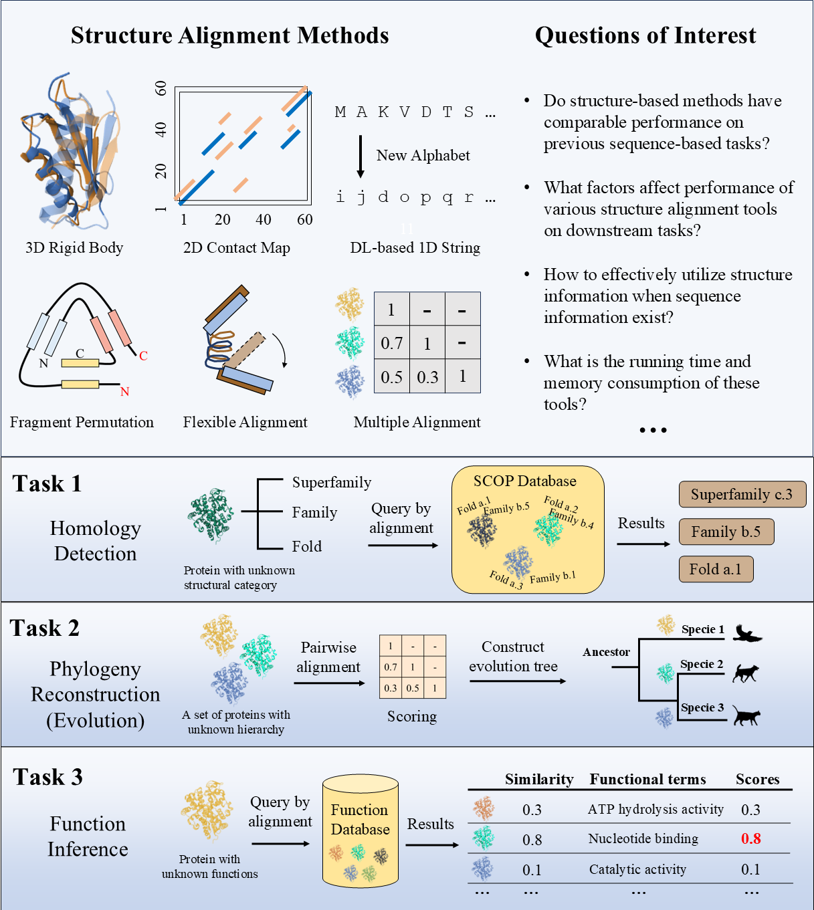

## Acknowledgment
We thank the excellent work done by DALI, Foldtree, and TEMPROT, and also other teams that have been working on protein structure datasets such as SwissTree, UniProt, and CAFA. Many codes of our work are based on existing public codes, and we adopt them for our investigation. Although we call it _evaluator_ in this wage, we only showcase how we benchmark each tool on tasks we assess.

## Results
<p float="left">
  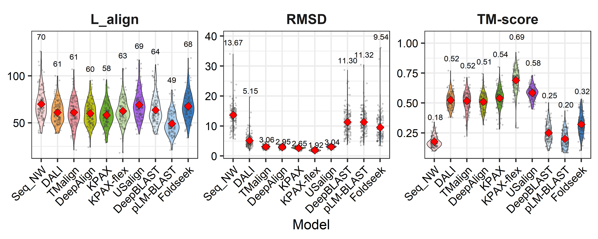
  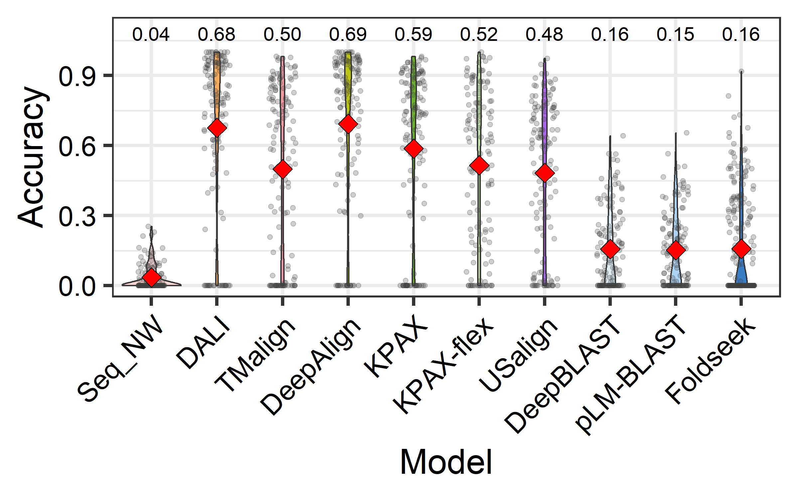
</p>

<p float="left">
  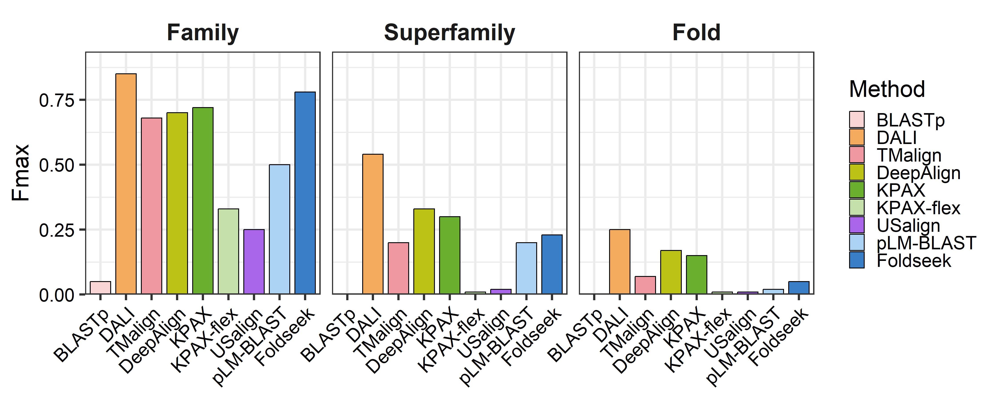
  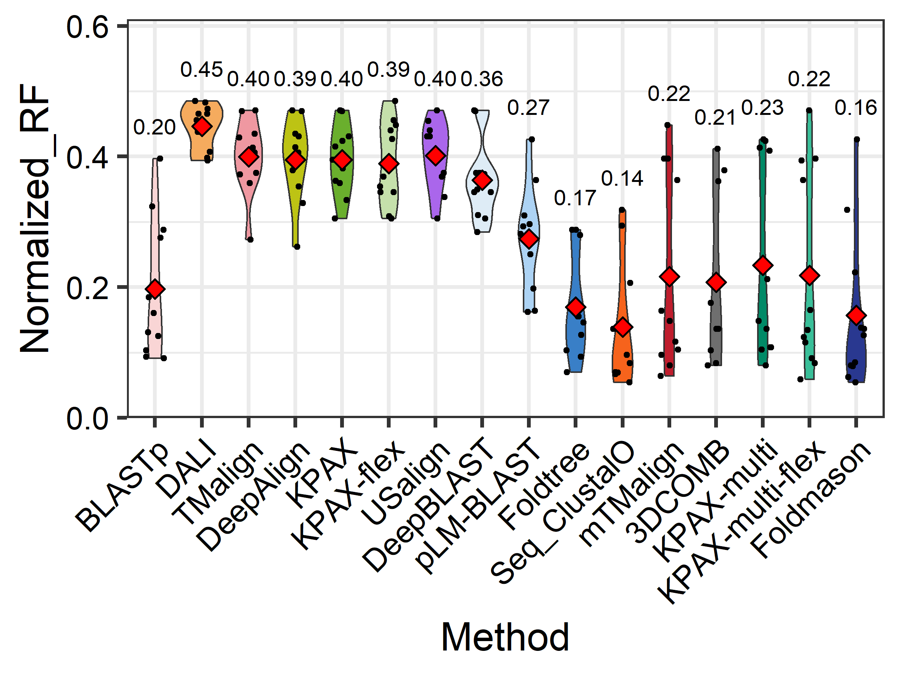
  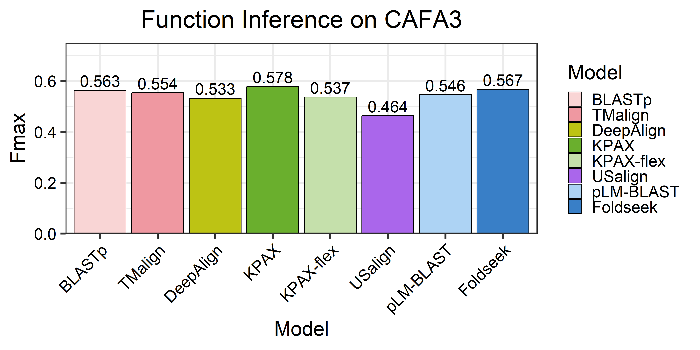
</p>

**Figure 1.** Results for all tasks. **Fisrt row**: Reference-independent alignment metrics and reference-dependent accuracy on Malisam. **Second row**: Performance on homology detection, phylogeny reconstruction, and function inference.

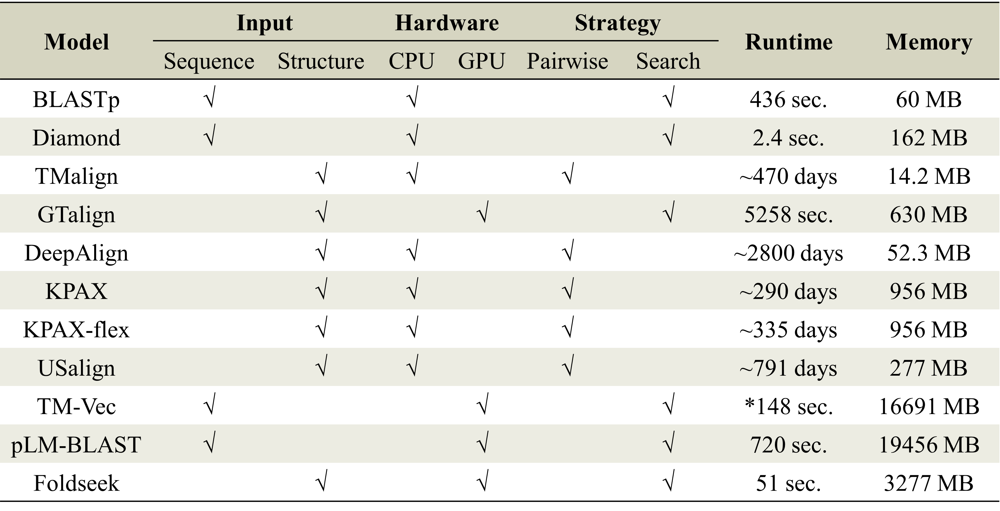

**Figure 2.** Running time and memory consumption comparison of different alignment tools. * indicates that TM-Vec is not able to process >1000 aa and we use truncated sequences as inputs instead.
.

## Environment
Detailed information please refer to our manuscript and the online supplementary.

```
* python=3.7.12
* numpy=1.21.6
* biopython=1.81
* pandas = 1.3.5
```

## Database download
Before running any codes, please download all databases for benchmarking following the instruction in the `database` folder.

**Alignment performance**
* Malisam: **130** difficult non-homologous proteins in different families from SCOP (Accuracy, TM-score)
* Malidup: **241** difficult proteins with internal duplicated structures (Accuracy, TM-score)

**Homlogy detection**
* SCOP140: **140** proteins from the SCOP database and search against **15211** SCOPe 2.07 database for classification (Fmax)

**Phylogeny reconstruction**
* SwissTree: **ST001-ST010** trees, each with proteins ranging from **25** to **131** (RF distance, TCS score)

**Function inference**
* CAFA3-MF: **1137** proteins for molecular function prediction against **32421** proteins using homology search (Fmax, Smin, AUPR)

## Software and tools download
Download tools or methods you need to reproduce the results in our study. More information can be found in our manuscript. If you choose one or more of BLASTp, TMalign, DeepAlign, KPAX, and USalign, make sure their executable files are in the enviroment path and can be called directly. For the three deep-learning methods, you may setup separated conda environment for each of them, and ensure **they are installed in this project folder**.
* [BLASTp](https://ftp.ncbi.nlm.nih.gov/blast/executables/blast+/LATEST/)
* [TM-align](https://zhanggroup.org/TM-align/TMalign.cpp)
* [DeepAlign](https://github.com/realbigws/DeepAlign/)
* [KPAX](https://kpax.loria.fr)
* [US-align](https://github.com/pylelab/USalign)
* [DeepBLAST](https://github.com/flatironinstitute/deepblast)
* [pLM-BLAST](https://github.com/labstructbioinf/pLM-BLAST)
* [Foldseek](https://github.com/steineggerlab/foldseek)

Other methods tested in the manuscript include: BLASTp, Diamond, GTalign, Clustal Omega, mTMalign, 3DCOMB, FoldTree, and Foldmason.

## 1. Alignment quality evaluation (accuracy, TM-score)
For each tool, find the corresponding `*_Malidup.py` or `*_Malisam.py` script to generate results. Then use `concatResult.py` to generate a final csv file for accuracy or reference-independent metrics such as TM-scores and RMSD. The integrated results can be generated with the following pipeline:
```
# make sure you are in the folder that containing the Malidup or Malisam data folder
# Using DeepAlign as the example:
python script/deepalign_Malidup.py

# For processing eixisting results of TM-align and DALI:
python script/processMalidup.py

# After performing pairwise alignments with all tools in interest
python concatResult.py Malidup Malidup.accuracy accuracy
python concatResult.py Malidup Malidup.tmscore tmscore
```

For the three deep-learning methods, copy the corresponding `<algm>_<dataset>.py` script to their own folders and run from their own folders.
```
# make sure you have installed the pLM-BLAST project from github in the project folder
# make sure you have downloaded MalidupPDB.tar.gz, MalisamPDB.tar.gz, Malidup_plmblast_pt.tar.gz, and Malisam_plmblast_pt.tar.gz,
# and decompressed them as folders in the project folder

python createFastaFold.py MalidupPDB MalidupFasta
python createFastaFold.py MalisamPDB MalisamFasta
cp plmblast_Malisam.py plmblast_Maliudp.py pLM-BLAST
cd pLM-BLAST
python plmblast_Malidup.py
```

```
# make sure you have installed the deepblast project from github in the project folder

cp deepblast_Malisam.py deepblast_Maliudp.py deepblast
cd deepblast
python deepblast_Malidup.py
```

```
# make sure you have installed the foldseek project from github and it can be called directly

sh script/pairwise_pipeline.sh
python script/foldseek_Malidup.py
```

If you want to know how we calculate the accuracy and extract the metrics from TMalign result, see the next two subsessions.

### Accuracy evaluation
First retrieve the alignment pattern from the alignment result from any alignment tools, and then arrange it as the following:
```
ppakRPEQGLLRLRKGLD--lYANLRPAQIF--DVDILVVREltGNMFGDILSDEASQLTgs----igMLPSASLGe-----------graMYEPIHGS
-ftyEEVLAFEERLEREAeapSLYTVEHKVDfpVEHCYEKAL--GAEGVEEVYRRGLAQRhalpfeadGVVLKLDDltlwgelgytaraprFALAYKFP
```

We name the above format without sequence descriptions as **.ali** format. Then run the following code to calculate the accuracy given a ground truth alignment:
```
python accuracy.py <groundtruth.ali> <predict.ali>
```

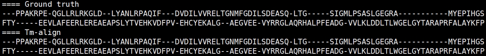

The outputs contain precision, recall, and accuracy score. Lowercase letters in the `<predict.ali>` file stand for unaligned or low-confident positions. Noted that letters in the `<groundtruth.ali>` file are all uppercase, and `<predict.ali>` file with only uppercase letters results in identical accuracy, recall and precision scores.

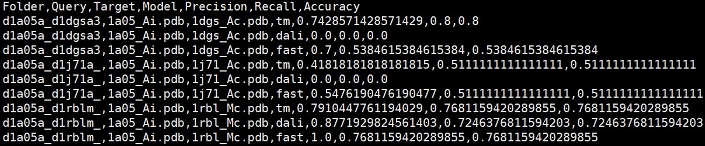

### TM-score evaluation
We provide the downloaded **TMalign** source file here and please follow the script below to compile it. Add the path where TM-align is in to the environment so that it can be called directly. Detailed intructions of TM-align are on [Zhang's lab](https://zhanggroup.org/TM-align/) website.
```
g++ -static -O3 -ffast-math -lm -o TMalign TMalign.cpp
export PATH=$PATH:$(pwd) # you can add the path directly into your .bashrc configure file
```

Before running TMalign we need to convert the provided `*.ali` file into `fasta` format which looks like the follows. The codes for conversion is included in our pipeline.
```
>aln1
ppakRPEQGLLRLRKGLD--lYANLRPAQIF--DVDILVVREltGNMFGDILSDEASQLTgs----igMLPSASLGe-----------graMYEPIHGS
>aln2
-ftyEEVLAFEERLEREAeapSLYTVEHKVDfpVEHCYEKAL--GAEGVEEVYRRGLAQRhalpfeadGVVLKLDDltlwgelgytaraprFALAYKFP
```

Use the following code to calculate the tm-score given two pdb files and an alignment file in fasta format:
```
TMalign <query.pdb> <target.pdb> -I <result.ali.fasta>
```

Our pipeline extracts the TM-score and RSMD from the TMalign result file, and calculate the Lalign using the provided `*ali` file by counting the uppercase letters instead.

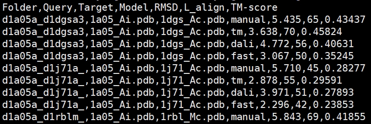

## 2. Homology detection accuracy evaluation (Fmax)
We adopt the classification pipeline used in DaliLite to classify 140 proteins from SCOP against 15211 pdbs from SCOPe 2.07. This task is a binary classification for all protein pairs between query set and target set. Each pair has a label denoting whether they are in the same family, superfamily, or fold. After downloading the data from the DALI website, decompress it and rename it as `SCOP140`.

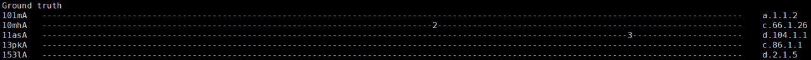

To perform the evaluation, first generate pairwise alignment or database search results for the tool of interest using `classification_*.py` and make sure the outfile file is in the `SCOP140/ordered_pooled`, then use `evaluate_ordered_lists.pl` in the `SCOP140/bin` folder as described in the `README.benchmark` file.

```
# Results for TM-align, DALI, and DeepAlign are provided in the downloaded SCOP140 dataset from the DALI server website
cp script/classification_kpax.py script/classification_usalign.py genComp_classification.py classificationPipeline.sh SCOP140
cd SCOP140
# We implement a batch process manner for large-scale pairwise comparison
python genComp_classification.py
# using 64 batch:
sh classification.sh kpax 64
cp ../script/merge_classification_kpax.sh ../script/process_classification_kpax.py kpax_results
cd kpax_result
sh merge_classification_kpax.sh
python process_classification_kpax.py

# After performing alignments with all tools in interest, we have all results in the ordered_pooled folder
bin/evaluate_ordered_lists.pl ordered_pooled/ combinetable.pdb70 scope_140_targets.list pooled > evaluation_results/pooled_pdb70
```

For the three deep learning methods:
```
# pLM-BLAST
cp scipt/classification_plmblast.sh pLM-BLAST
cd pLM-BLAST
sh classification_plmblast.sh
```

```
# TM-Vec
sh script/SCOP140_foldseek.sh
```

```
# Foldseek
sh script/SCOP140_foldseek.sh
```

## 3. Phylogeny reconstruction quality evaluation (RF distance, TCS score)
We adopt the workflow used in Foldtree to investigate the performance of different tools on predicting evolutionary hierarchies. RF distance is used to quantify the topological difference between the predicted tree and the ground-truth species tree.

To run the pipeline, first generate pairwise alignment or database search results for the tool of interest using `swisstreeIterate_*.py`, then change the working path to the `foldtree` directory and run `TreeConstruct.py` with corresponding arguments.

```
# before running foldtree, you may activate the foldtree-specific conda environment first
python script/siwsstreeIterate_kpax.py
cd foldtree
python TreeConstruct.py KPAX Identity
cd ../
```

## 4. Function inference
A multi-label multi-class classification task. The GO terms of the target protein are transfered to the query protein, using the structural similarity value as the coefficient for all terms.

First generate pairwise alignment or database search results for the tool of interest using `function_*.py`, then change the working path to the `CAFA3_MF` directory and run `evaluate.py` with corresponding arguments.

```
python script/function_kpax.py
cd CAFA3_MF
python evaluate.py --in KPAX_SO-Identity --npy kpax_soident.npy
```
