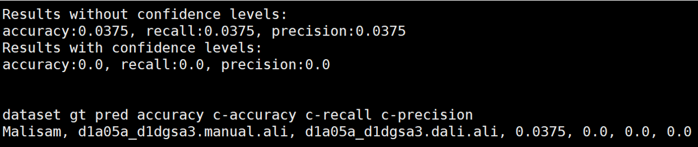
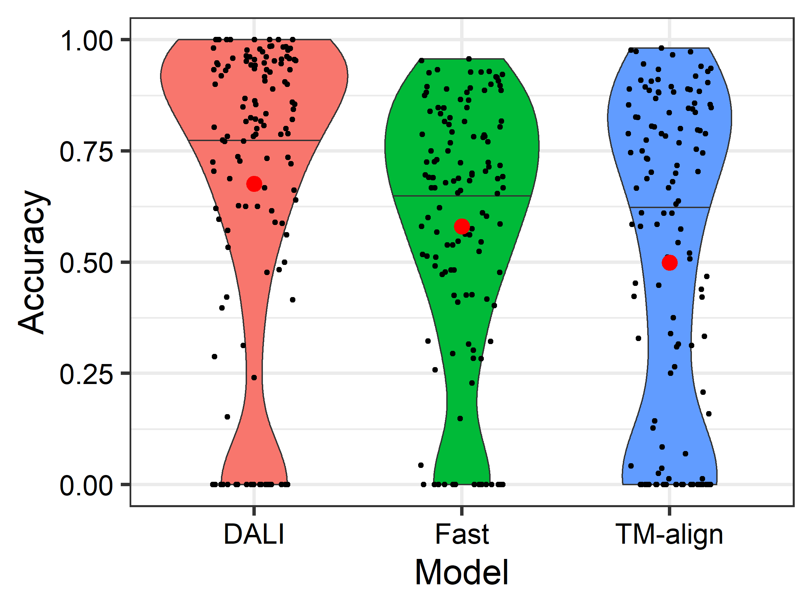
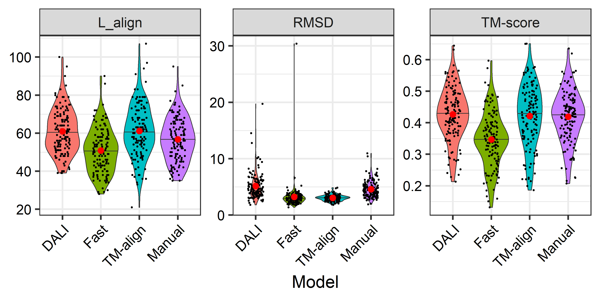

# StructAlign-evaluator (in progress)
Benchmarking protein structure alignment algorithms on several databases
* SCOP140: **140** proteins from the SCOP database and search against SCOPe 2.07 database for classification (Accuracy)
* SCOP200: **200** non-homologous proteins from the SCOP database used in the TM-align paper (TM-score)
* Malisam: **130** difficult non-homologous proteins in different families from SCOP (Accuracy, TM-score)
* Malidup: **241** difficult proteins with internal duplicated structures (Accuracy, TM-score)
* HOMSTRAD: **590** single-domain non-homologous protein structure alignments (Accuracy, TM-score)
* CAFA3-MF: **1137** proteins for molecular function prediction against 36008 proteins using homology search (Fmax, AUPR)
* ?, phylogeny dataset, reconstruct evolutionary distances

## Environment
```
* python=3.7.16
* numpy=1.21.5
```

## Database download
Before running any codes, please download all databases for benchmarking following the instruction in the `database` folder.

## Accuracy evaluation
First retrieve the alignment pattern from the alignment result from any alignment tools, and then arrange it as the following:
```
ppakRPEQGLLRLRKGLD--lYANLRPAQIF--DVDILVVREltGNMFGDILSDEASQLTgs----igMLPSASLGe-----------graMYEPIHGS
-ftyEEVLAFEERLEREAeapSLYTVEHKVDfpVEHCYEKAL--GAEGVEEVYRRGLAQRhalpfeadGVVLKLDDltlwgelgytaraprFALAYKFP
```

Then run the following code to calculate the accuracy given a ground truth alignment:
```
python accuracy.py <groundtruth.ali> <predict.ali>
```



The outputs contain precision, recall, and accuracy score. Lowercase letters in the `<predict.ali>` file stand for unaligned or low-confident positions. Noted that letters in the `<groundtruth.ali>` file are all uppercase, and `<predict.ali>` file with only uppercase output results in identical accuracy, recall and precision scores.


## TM-score evaluation
We provide the downloaded **TM-align** source file here and please follow the script below to compile it. Add the path where TM-align is in to the environment so that it can be called directly. Detailed intructions of TM-align are on [Zhang's lab](https://zhanggroup.org/TM-align/) website.
```
g++ -static -O3 -ffast-math -lm -o TMalign TMalign.cpp
export PATH=$PATH:$(pwd) # you can add the path directly into your .bashrc configure file
```

Before running TM-align you need to manually edit the provided `*.ali` file into `fasta` format which looks like the follows, and this file will be automatically generated in our pipeline.
```
>aln1
ppakRPEQGLLRLRKGLD--lYANLRPAQIF--DVDILVVREltGNMFGDILSDEASQLTgs----igMLPSASLGe-----------graMYEPIHGS
>aln2
-ftyEEVLAFEERLEREAeapSLYTVEHKVDfpVEHCYEKAL--GAEGVEEVYRRGLAQRhalpfeadGVVLKLDDltlwgelgytaraprFALAYKFP
```

Use the following code to calculate the tm-score given two pdb files and an alignment file in fasta format:
```
TMalign <query.pdb> <target.pdb> -I <result.ali.fasta>
```

The outputs contain TM-scores normalized by query and target protein, and also the alignment patternoutput looks as follows:


## Results

### Malisam





Our pipeline extracts the TM-score and RSMD from the TM-align result file, and calculate the Lalign using the provided `*ali` file by counting the uppercase letters instead.


