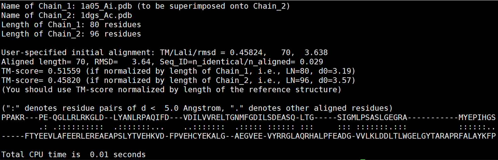
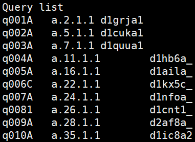
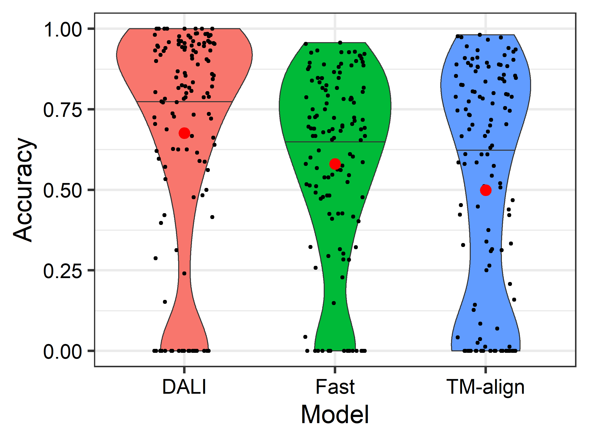
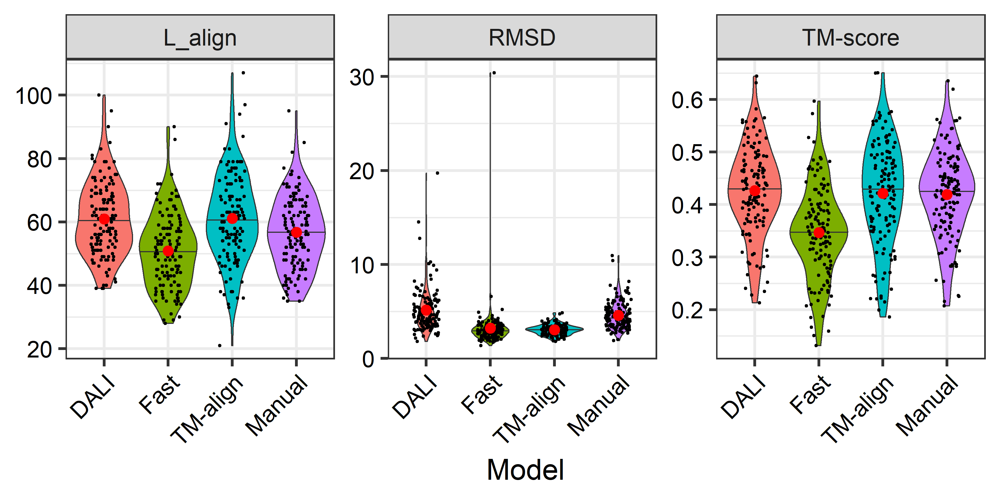
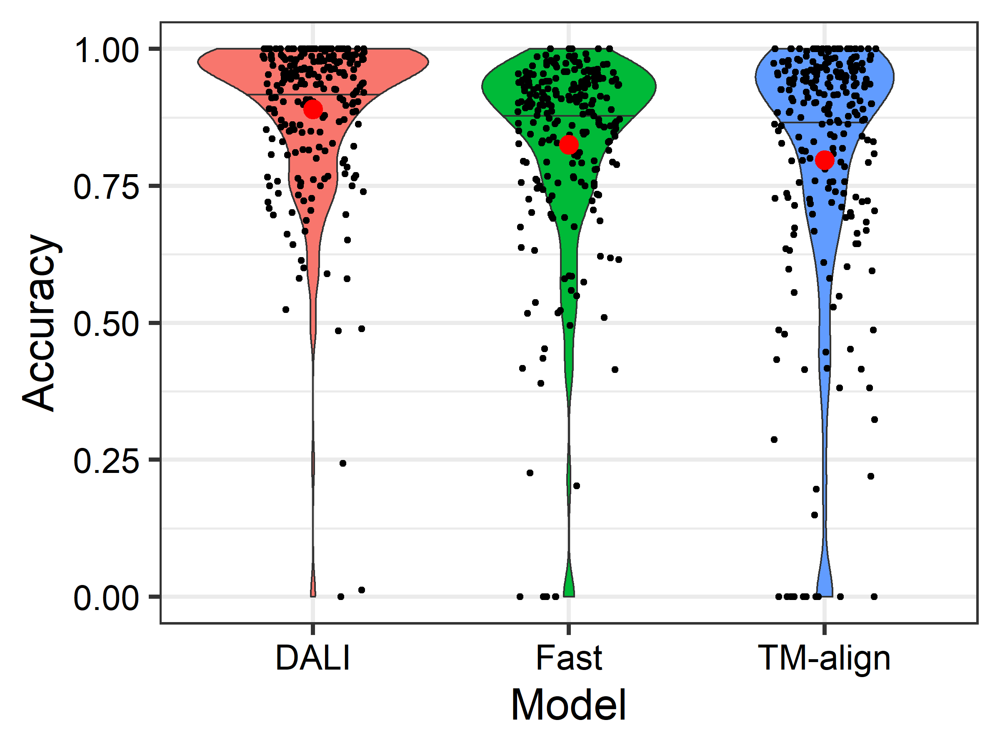
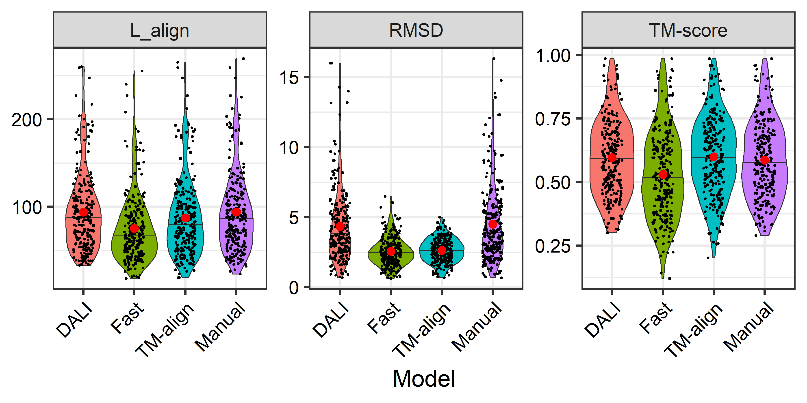

# StructAlign-evaluator
Benchmarking protein structure alignment algorithms on several downstream tasks, see our preliminary results and reports on BioRix
* Malisam: **130** difficult non-homologous proteins in different families from SCOP (Accuracy, TM-score)
* Malidup: **241** difficult proteins with internal duplicated structures (Accuracy, TM-score)
* SCOP140 (homology detection): **140** proteins from the SCOP database and search against **15211** SCOPe 2.07 database for classification (Fmax)
* SwissTree (phylogeny reconstruction): **ST001-ST010** trees, each with proteins ranging from **25** to **131** (RF distance, TCS score)
* CAFA3-MF (function inference): **1137** proteins for molecular function prediction against **32421** proteins using homology search (Fmax, Smin, AUPR)

## Acknowledgment
We thank the excellent work done by the DALI, Foldtree, and TEMPROT, and also teams that have been working on protein structure datasets such as SwissTree, UniProt, and CAFA. Many codes of our work are based on existing public codes, and we adopt them for investigating other alignment tools. Although we call it _evaluator_ in this wage, we only showcase how we benchmark each tool on tasks we assess. The main contributions of our study are incorporating a wide spectrum of methods and tools, and considering different ways to utilize both sequence and structure information. We also performa analysis from our results and provide insight to how different methods perform differently in downstream tasks.

## Environment
```
* python=3.7.16
* numpy=1.21.5
```

## Database download
Before running any codes, please download all databases for benchmarking following the instruction in the `database` folder.

## 1. Alignment quality evaluation (accuracy, TM-score)

### accuracy evaluation
First retrieve the alignment pattern from the alignment result from any alignment tools, and then arrange it as the following:
```
ppakRPEQGLLRLRKGLD--lYANLRPAQIF--DVDILVVREltGNMFGDILSDEASQLTgs----igMLPSASLGe-----------graMYEPIHGS
-ftyEEVLAFEERLEREAeapSLYTVEHKVDfpVEHCYEKAL--GAEGVEEVYRRGLAQRhalpfeadGVVLKLDDltlwgelgytaraprFALAYKFP
```

Then run the following code to calculate the accuracy given a ground truth alignment:
```
python accuracy.py <groundtruth.ali> <predict.ali>
```


The outputs contain precision, recall, and accuracy score. Lowercase letters in the `<predict.ali>` file stand for unaligned or low-confident positions. Noted that letters in the `<groundtruth.ali>` file are all uppercase, and `<predict.ali>` file with only uppercase output results in identical accuracy, recall and precision scores.


### TM-score evaluation
We provide the downloaded **TM-align** source file here and please follow the script below to compile it. Add the path where TM-align is in to the environment so that it can be called directly. Detailed intructions of TM-align are on [Zhang's lab](https://zhanggroup.org/TM-align/) website.
```
g++ -static -O3 -ffast-math -lm -o TMalign TMalign.cpp
export PATH=$PATH:$(pwd) # you can add the path directly into your .bashrc configure file
```

Before running TM-align you need to manually edit the provided `*.ali` file into `fasta` format which looks like the follows, and this file will be automatically generated in our pipeline.
```
>aln1
ppakRPEQGLLRLRKGLD--lYANLRPAQIF--DVDILVVREltGNMFGDILSDEASQLTgs----igMLPSASLGe-----------graMYEPIHGS
>aln2
-ftyEEVLAFEERLEREAeapSLYTVEHKVDfpVEHCYEKAL--GAEGVEEVYRRGLAQRhalpfeadGVVLKLDDltlwgelgytaraprFALAYKFP
```

Use the following code to calculate the tm-score given two pdb files and an alignment file in fasta format:
```
TMalign <query.pdb> <target.pdb> -I <result.ali.fasta>
```

The outputs contain TM-scores normalized by query and target protein, and also the alignment patternoutput looks as follows:



Our pipeline extracts the TM-score and RSMD from the TM-align result file, and calculate the Lalign using the provided `*ali` file by counting the uppercase letters instead.


## 2. Homology detection accuracy evaluation (Fmax)
We adopt the classification pipeline used in DaliLite to classify 140 proteins from SCOP against 15211 pdbs from SCOPe 2.07. Binary classification for all protein pairs between query set and target set.




## 3. Phylogeny reconstruction quality evaluation (RF distance, TCS score)
We adopt the workflow used in Foldtree to investigate the performance of different tools on predicting evolutionary hierarchies. RF distance is used to quantify the topological difference between the predicted tree and the ground-truth species tree.

## 4. Function inference
A multi-label multi-class classification task. The GO terms of the target protein are transfered to the query protein, using the structural similarity value as the coefficient for all terms.


## Results

### Malisam





### Malidup




